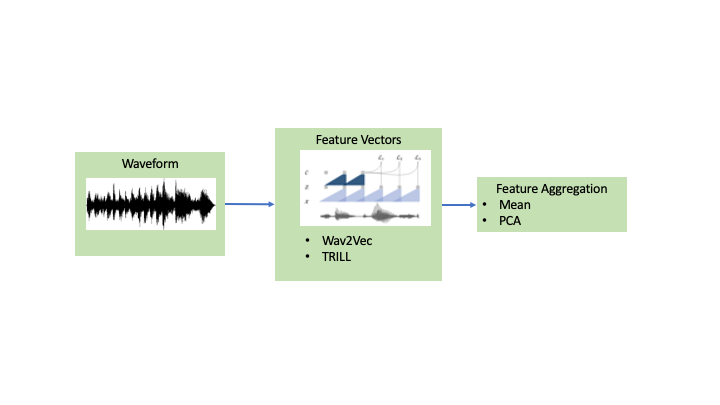

# Detecting Distribution Shift in Speech Audio

This repo contains tools for doing covariate shift detection on speech audio, and an example application on the [VOiCES dataset](https://iqtlabs.github.io/voices/). Our approach uses pretrained speech featurizers and aggregation methods to embed waveforms into fixed length vectors.  



We then use the approach of [Failing Loudly](https://arxiv.org/abs/1810.11953) to detect distribution shift, by first using untrained autoencoders for dimensionality reduction on the embeddings, followed up by two-sample non-parametric hypothesis testing on samples of source and target data.

## Contents

* `embeddors.py`: Classes wrapping models that convert waveforms to sequences of feature vectors.
* `aggregators.py`:  Classes for aggregrating sequences of feature vectors into single, fixed-length vector embeddings.
* `data_utils.py`:  Tools for combining featurizors and aggregators into the embedding pipeline and applying it to lists of waveforms or .wav files.
* `detection_utils.py`:  Functional wrappers around [the alibi_detect implementation](https://docs.seldon.io/projects/alibi-detect/en/stable/methods/mmddrift.html) of [MMD two sample testing](https://en.wikipedia.org/wiki/Kernel_embedding_of_distributions#Kernel_two-sample_test) for single and repeated tests.
* `hypothesis_test.ipynb`:  This notebook walks through loading the VOiCES dataset, preprocessing the waveforms into embeddings, and evaluating the performance of distribution shift detection.

## Dependencies and prerequisites

To follow the experiments in `hypothesis_test.ipynb` you will need to download the [VOiCES dataset](https://iqtlabs.github.io/voices/).  Instructions for that can be found [here](https://iqtlabs.github.io/voices/downloads/).  We recommend using the devkit subset for expediency.

The following packages are required

```
alibi-detect
torch
fairseq
tensorflow
tensorflow_hub
librosa
pandas
seaborn
wget
```
All can be installed using pip
```
pip install -r requirements.txt
```